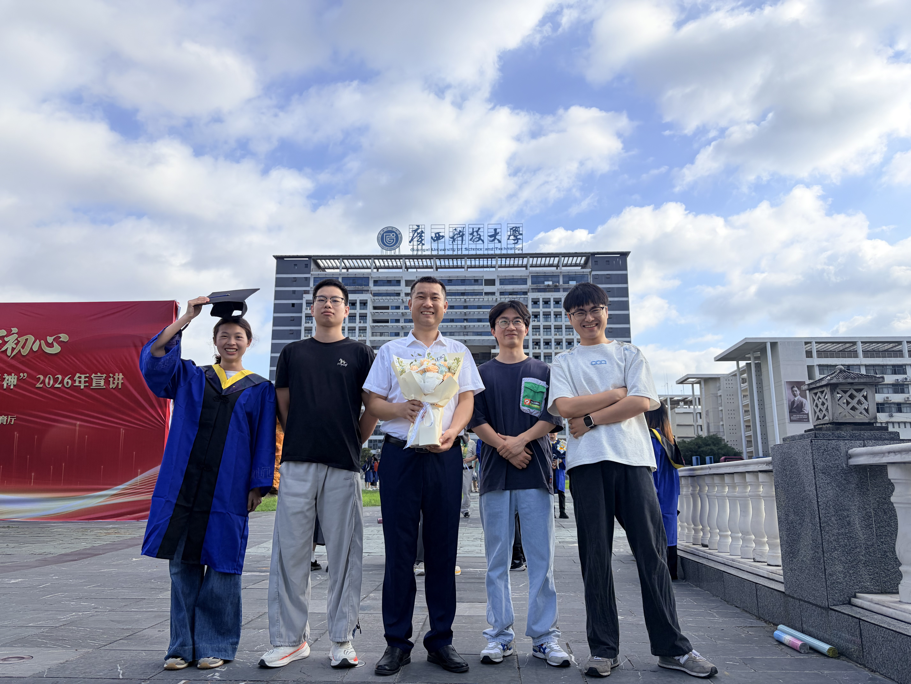

# 716 蒋老师课题组深度学习资源导航


## 团队介绍
## 团队合照



面向课题组内部学习与科研协作的资源仓库，目标是：

- 快速定位某一方向的入门材料与经典资源
- 沉淀组内常用课程、论文、代码仓库与工具
- 方便组会分享、论文阅读与新成员 onboarding
- 持续更新，形成可维护的知识导航

## 如何使用 How to Use

- 从下方目录进入对应主题页面
- 每个主题页可以继续细分为「入门 / 进阶 / 经典 / 工具 / 实战」

- 如果你有想补充的内容，可以直接编辑对应页面并提交每条资源建议附上：链接、简介、推荐理由、适合人群

## 目录

- [论文 Papers](#论文-papers)
  - [计算机视觉 Computer Vision](papers/computer-vision.md)
  - [自然语言处理 Natural Language Processing](papers/natural-language-processing.md)
  - [图神经网络 Graph Neural Networks](papers/graph-neural-networks.md)
  - [生成模型 Generative Models](papers/generative-models.md)
  - [强化学习 Reinforcement Learning](papers/reinforcement-learning.md)
  - [交通信号灯控制 Traffic Signal Control](papers/traffic-signal-control.md)
  - [车道线检测 Lane Detection](papers/lane-detection.md)
- [课程 Courses](#课程-courses)
  - [深度学习课程](courses/deep-learning.md)
  - [机器学习课程](courses/machine-learning.md)
  - [数学基础](courses/math-foundations.md)
- [代码资源 Code Resources](#代码资源-code-resources)
  - [PyTorch 资源](code-resources/pytorch.md)
  - [TensorFlow 资源](code-resources/tensorflow.md)
  - [优秀 GitHub 仓库](code-resources/useful-repos.md)
- [数据集 Datasets](#数据集-datasets)
  - [视觉数据集](datasets/vision-datasets.md)
  - [NLP 数据集](datasets/nlp-datasets.md)
  - [通用数据集](datasets/general-datasets.md)
- [科研工具 Tools](#科研工具-tools)
  - [论文检索与阅读工具](tools/paper-tools.md)
  - [论文写作工具](tools/writing-tools.md)
  - [实验管理工具](tools/experiment-tools.md)
- [组会与论文分享 Seminar](#组会与论文分享-seminar)
  - [组会记录](seminar/README.md)
  - [2026 年论文分享](seminar/2026.md)
- [贡献方式 Contribution](#贡献方式-contribution)

---

## 论文 Papers

适合沉淀各方向的代表性工作、入门综述、经典论文与近期进展。

- [计算机视觉 Computer Vision](papers/computer-vision.md)
- [自然语言处理 Natural Language Processing](papers/natural-language-processing.md)
- [图神经网络 Graph Neural Networks](papers/graph-neural-networks.md)
- [生成模型 Generative Models](papers/generative-models.md)
- [强化学习 Reinforcement Learning](papers/reinforcement-learning.md)
- [交通信号灯控制 Traffic Signal Control](papers/traffic-signal-control.md)
- [车道线检测 Lane Detection](papers/lane-detection.md)


## 课程 Courses

适合整理系统学习路径，帮助新成员从基础到进阶逐步建立知识框架。

- [深度学习课程](courses/deep-learning.md)
- [机器学习课程](courses/machine-learning.md)
- [数学基础](courses/math-foundations.md)


## 代码资源 Code Resources

适合收录常用框架教程、实战项目、优秀开源仓库与复现资源。

- [PyTorch 资源](code-resources/pytorch.md)
- [TensorFlow 资源](code-resources/tensorflow.md)
- [优秀 GitHub 仓库](code-resources/useful-repos.md)

建议关注：

- 官方文档与教程
- 高质量教学项目
- 常用模板仓库
- 论文复现代码

## 数据集 Datasets

适合整理不同研究方向常用数据集，并注明任务类型、规模与使用场景。

- [视觉数据集](datasets/vision-datasets.md)
- [NLP 数据集](datasets/nlp-datasets.md)
- [通用数据集](datasets/general-datasets.md)


## 科研工具 Tools

适合收录论文检索、文献管理、写作排版、实验追踪与可视化工具。

- [论文检索与阅读工具](tools/paper-tools.md)
- [论文写作工具](tools/writing-tools.md)
- [实验管理工具](tools/experiment-tools.md)

可按以下维度补充：

- 检索 / 阅读
- 引用管理
- 绘图 / 排版
- 实验记录 / 结果管理
- 协作与分享

## 组会与论文分享 Seminar

适合沉淀组会记录、分享资料、论文解读与阶段性总结。

- [组会记录](seminar/README.md)
- [2026 年论文分享](seminar/2026.md)

建议采用统一格式，便于后续检索：

- 时间
- 分享人
- 主题 / 论文标题
- 链接
- 简要摘要
- 个人理解 / 讨论要点

## 推荐资源条目模板 Template

你可以在各个子页面里按下面这个格式补充：

```markdown
### 资源名称

- 链接：<https://example.com>
- 简介：一句话说明这是什么资源。
- 推荐理由：为什么值得看。
- 适合人群：初学者 / 进阶 / 做相关方向的同学。
- 备注：可选，例如是否有代码、是否适合作为入门材料。
```

## 贡献方式 Contribution

欢迎课题组成员补充资源，建议优先补充以下内容：

1. 各方向的入门综述与经典论文
2. 高质量课程与配套学习笔记
3. 常用代码仓库与复现项目
4. 常见公开数据集
5. 提高科研效率的工具

建议每条资源包含：

- 名称
- 链接
- 简介
- 添加人
- 添加日期

如果你愿意，也可以继续补充：

- 星标推荐资源
- 按研究方向整理的阅读路线
- 新生入门指南
- 组内共享学习计划
